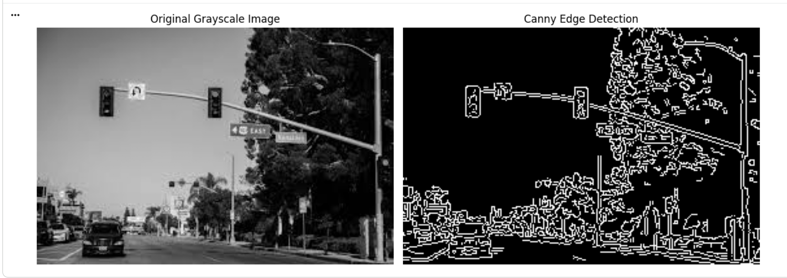
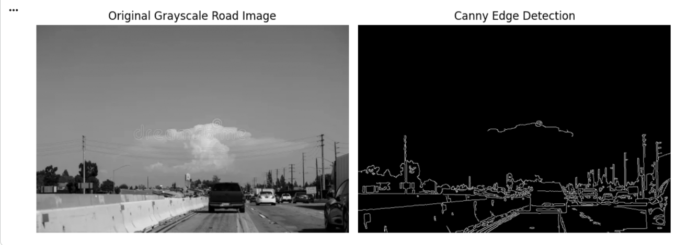

# Lab 05: Implementation on Edge Detection 🚀

**Course:** AICL 3605 - Computer Vision Lab  
**Author:** Muhammad Haroon  
**Registration Number:** 23108124  

## Overview
This repository contains Python and OpenCV implementations of core edge detection algorithms. The project explores spatial filtering methods to identify significant intensity transitions corresponding to object boundaries, which is a crucial step for image segmentation and object recognition in Computer Vision.

## Features & Navigation Flow
The main logic and outputs are contained within the Jupyter Notebook (`LAB_05_Implementation_on_Edge_Detection.ipynb`), which is structured sequentially:

1. **Code Example 1: Sobel Edge Detection** Extracts horizontal and vertical gradients to highlight structural boundaries using the Sobel operator.
2. **Code Example 2: Prewitt Edge Detection** Utilizes predefined kernels to identify architectural and infrastructural edges.
3. **Code Example 3: Canny Edge Detection** Applies a multi-stage algorithm (including hysteresis thresholding) for sharp, noise-reduced edge extraction.
4. **Case Study 1: Medical Image Edge Detection** Highlights tumor boundaries and internal structures in CT/MRI scans using optimized Canny edge detection.
5. **Case Study 2: Road and Lane Detection** Applies Gaussian blurring and edge extraction to isolate road lanes for autonomous vehicle navigation.

## Technologies Used
* **Python 3.x**
* **OpenCV** (`cv2`)
* **NumPy**
* **Matplotlib** (for visualization)

## How to Run
> **Note:** This notebook is specifically designed to be run in **Google Colab** as it utilizes `google.colab import files` for dynamic image uploading.

1. Open the `.ipynb` file in Google Colab.
2. Run the cells sequentially.
3. When prompted by the execution output, upload the respective sample images (e.g., a grayscale MRI scan, a road image) from your local machine to see the edge detection algorithms in action.

---

## Visual Results
Below are some highlights of the edge detection algorithms applied during the lab:

### 1. Canny Edge Detection (Standard)
*Extracting clean, noise-reduced edges using the Canny algorithm.*

### 2. Autonomous Vehicle Lane Detection (Case Study)
*Gaussian Blur applied prior to Canny Edge Detection to effectively isolate lane boundaries.*

